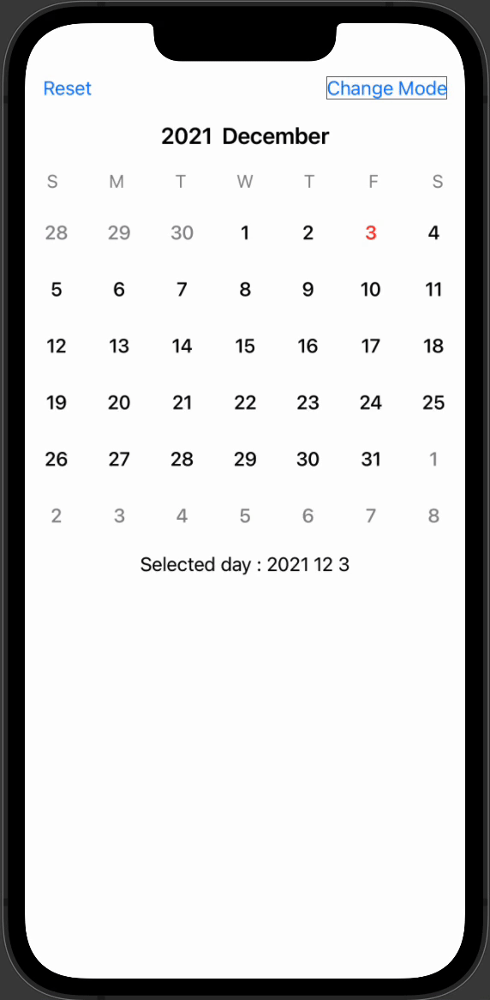

# ``JHCalendar``

SwiftUI Customizable Calendar Library


## Overview

Customizable Calendar Library.



## Download

Use swift package manager.

https://github.com/jaeho0718/JHCalendar > Exact Version 1.2.0

## Basic

Check Sources/JHCalendar/ExampleView.swift

```swift
    import SwiftUI

    struct ContentView : View {

        @StateObject var calendarManager = CalendarManger(start: .startDefault, 
                                                          end: .endDefault, 
                                                          point: .currentDefault)

        var body : some View {
            JHCalendar(content: { component in 
                DefaultCalendarDayView(component: component)
            })
            .environmentObject(calendarManager)
        }
    }
```

## Guidline

- Declare CalendarManager

    - To use JHCalendar,CalendarManager sould be declared. (**Important**)
    
    ```swift
        CalendarManger(mode : .Month,start: .startDefault, end: .endDefault, point: .currentDefault)
    ```
    - mode : Calendar mode (Month/Week)
    - start : Calendar start page
    - end : Calendar end page
    - point : Calendar start date

- Declare JHCalendar

    ```swift
        JHCalendar(content: { component in 
            DefaultCalendarDayView(component: component)
        })
    ```

    - content : The view that will be used to display the days of the week in the calendar. (you can use DefaultCalendarDayView)

    - component : A structure containing specific information about the days of the week to be displayed.

        ```swift
            struct CalendarComponent {
                var year : Int
                var month : Int
                var day : Int
            }
        ```

- EnvironmentKey

    - EnvironmentKey that can change the settings of the calendar.

    ```swift
        JHCalendar(content: { component in 
            DefaultCalendarDayView(component: component)
        })
        .environment(\.calendarHeight, 60)
        .environment(\.calendarWeekSymbols, Calendar.current.veryShortWeekdaySymbols)
        .environment(\.calendarShowTitle, true)
        .environment(\.calendarWeekFont, .callout)
        .environment(\.calendarWeekColor, .secondary)
    ```

    - calendarHeight : The default height of the calendar day cell. The default is 50.
    
    - calendarWeekSymbols : A symbol representing the week of the calendar. By default, localized day values ​​are displyed.

    - calendarShowTitle : Whether the calendar year/month title is displayed.

    - calendarWeekFont : Calendar weekday font.

    - calendarWeekColor : Calendar weekday font color.
