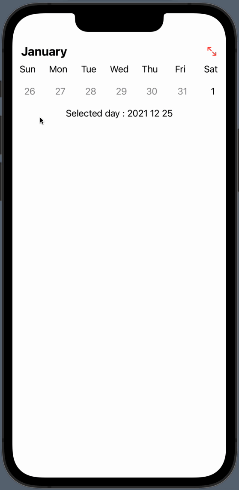
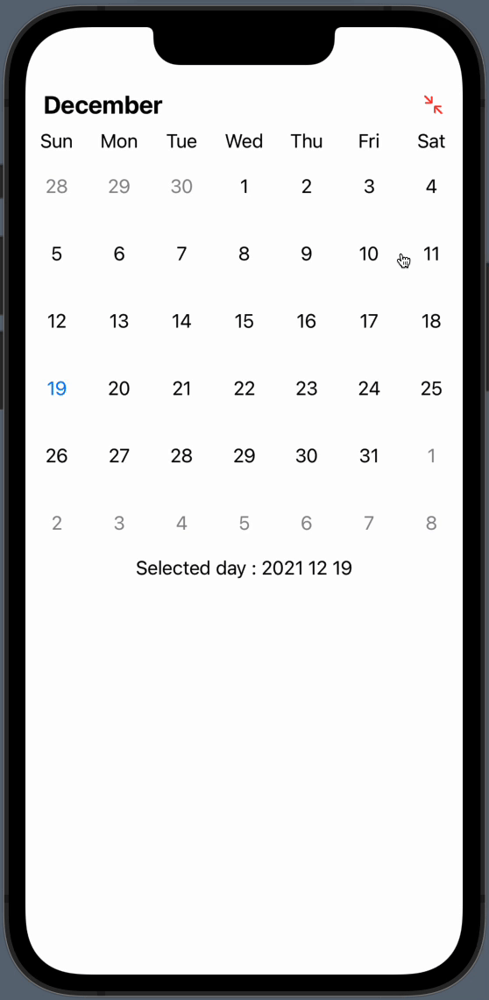
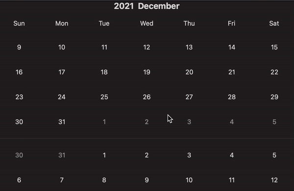

# ``JHCalendar``

SwiftUI Customizable Calendar Library


## Overview

SwiftUI Customizable Calendar Library.

## Download

Use swift package manager.

https://github.com/jaeho0718/JHCalendar > Exact Version 2.0.0

## ScreenShot
|WeekdayMode|MonthMode|ScrollDisplayMode|
|-----------|---------|-----------------|
||||

## Basic

Check Sources/JHCalendar/ExampleView.swift

```swift
    import SwiftUI

    struct ContentView : View {

        @StateObject var calendarManager = CalendarManger(mode : .Month,
                                                          startDate : .startDefault,
                                                          endDate : .endDefault,
                                                          startPoint : .current)

        var body : some View {
            JHCalendar(cellHeight : 50) { comp in 
                DefaultCalendarDayView(component: component)
            }
            .environmentObject(calendarManager)
        }
    }
```

## Usage

- Declare CalendarManager

    - To use JHCalendar,CalendarManager sould be declared. (**Important**)
    
    ```swift
        CalendarManger(mode : .Month,startDate: .startDefault, endDate: .endDefault, startPoint: .currentDefault)
    ```
    - mode : Calendar mode (Month/Week) (In macos,only support Month mode)
    - startDate : Calendar first date
    - endDate : Calendar last date
    - startPoint : Calendar start point when view appears.
    - you can get page info in CalendarManager.page.current

- Declare JHCalendar

    ```swift
        JHCalendar(cellHeight : 50) { comp in 
            DefaultCalendarDayView(component: component)
        }
        .environmentObject(calendarManager)
    ```

    - content : The view that will be used to display the day content in the calendar. (you can use DefaultCalendarDayView)

    - component : A structure containing specific information about the day.

        ```swift
            struct CalendarComponent {
                var year : Int
                var month : Int
                var day : Int
            }
        ```

- Customize Calendar

    - You can customize all components of calendar by using Modifier.

    ```swift
        JHCalendar(content: { component in 
            DefaultCalendarDayView(component: component)
        })
        .customWeekdaySymbols(symbols : ["S","M,"T","Wed","T","F","S"])
        .weekdaySymbolColor(color : .primary)
        .weekdayFont(font : .caption2)
        .calendarCellAccentColor(primary : .primary,secondary : .secondary)
        .showTitle(false)
        .showWeekBar(true)
        .calendarDisplayMode(.page)
    ```
    
    |view modifier|content|
    |-------------|-------|
    |customWeekdaySymbols|set custom weekday symbol|
    |weekdaySymbolColor|set weekday color|
    |weekdayFont|set weekday font|
    |calendarCellAccentColor|set calendar accent Color.|
    |showTitle|set title visibility|
    |showWeekBar|set weekday visivility|
    |calendarDisplayMode|set calendar displaymode (page/scroll) (only support iOS)|
